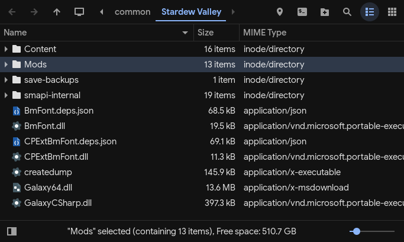

# Installation

1. Clone this repository into Stardew Valley's game directory.

   - Right click on Stardew Valley in your Steam library.
   - Manage > Browse local files.

2. Name the cloned directory `Mods`.

   - Steam Deck/Linux users can use this command to clone the repository:

   ```sh
   git clone https://git.vomitblood.com/Vomitblood/stardew-valley-mods.git Mods
   ```

   - Stardew Valley game directory should look like this:  
     

3. Install SMAPI. Follow the instructions for your platform on [the official website](https://smapi.io/).
4. Run the game. Profit.
